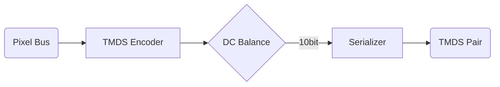

> 做协议学习笔记时，我喜欢按照“迭代脉络 → 物理层 → 编码 → 状态机”的顺序去拆，所有细节都能挂在这个主线下。

## 1. 版本演进与应用场景

- **HDMI 1.3 → 1.4**：最关键的变化是速率从 2.25 Gbps 提升到了 3.4 Gbps，随后带来了 4K@30Hz、3D、以太网通道 (HEC) 等新功能。
- **接口形式**：Type A/B（经典）、Type C（Mini）、Type D（Micro），Type E 专供汽车电子。硬件设计要关注 crosstalk 与 EMI 预算。
- **时钟参考**：TMDS Clock 最大 340 MHz。对 FPGA 来说意味着 PLL 需要支持 742.5 MHz 以上的高速串并转换（8/10bit）。

## 2. TMDS 信号链

HDMI 的三条数据通道和一条时钟通道共享同一组差分对。数据链路遵循 TMDS（Transition Minimized Differential Signaling）编码：

1. **预处理**：像素数据按 R/G/B 通道送入，控制期 (HBlank/VBlank) 由 `CTL[3:0]` 置位。
2. **8b/10b**：先做 XOR/XNOR 降低翻转次数，再根据 DC 平衡选择 `q_m` 的极性，最后串化成 10bit。
3. **序列化**：常见做法是 OSERDES ×2 级联，时钟倍频 5 倍后 DDR 输出。
4. **传输层**：差分对阻抗 100 Ω，常见布局要求 5 mil 线宽、对内注入 GND Guard。板级 EMI 控制在 3 Gbps 以上尤为重要。

## 3. 控制期编码

在消隐阶段，TMDS 数据通道不再传输像素，而是携带帧同步信息。表格是我在阅读标准时整理的速查版本：

| CTL[3:0] | 意义 | 通道数据 |
| --- | --- | --- |
| `0001` | HSYNC 有效 | CH0 发送 `1011001100` |
| `0010` | VSYNC 有效 | CH1 发送 `1011001100` |
| `0011` | 同时有效 | CH2 发送 `1011001100` |
| 其他 | 保留 | 发送 `0100110011` |

多数字库会把这些模式烧在 ROM 里，自己实现时记得考虑 pipeline 的气泡管理。

## 4. 工程实践 Tips

1. **像素域与 TMDS 域**：强烈建议用 `pixel_clk` 做同步逻辑，再通过 `BUFPLL/OSERDES` 将 TMDS 域隔离，跨域只传控制字。
2. **ILA 观测**：抓取 10bit TMDS 码字能帮助快速定位出错 Stage。若 DC balance 震荡，意味着 XOR/XNOR 选择错了。
3. **前向纠错**：HDMI 1.4 仍旧没有 FEC，链路稳定性高度依赖布线与器件，量产要考虑眼图测试。
4. **带宽预算**：4K@30Hz RGB444 需要 297 MHz 像素时钟；8/10bit 之后每通道 2.97 Gbps，留足 20% 裕量。

下一篇会继续写 `InfoFrame`、EDID、HDCP 1.4 握手，欢迎一起交流。
